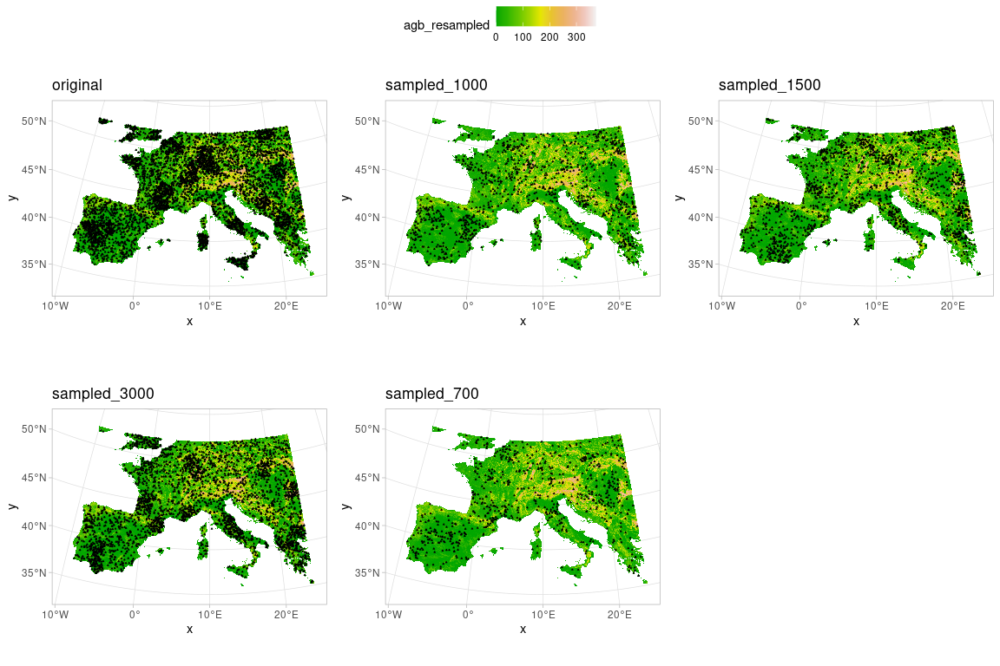
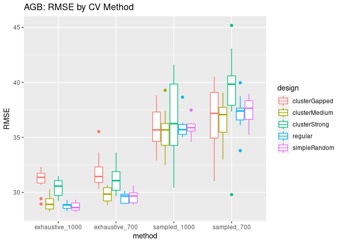
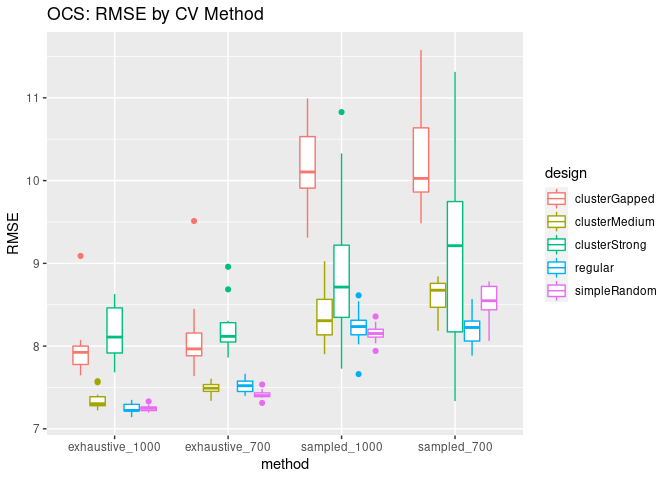
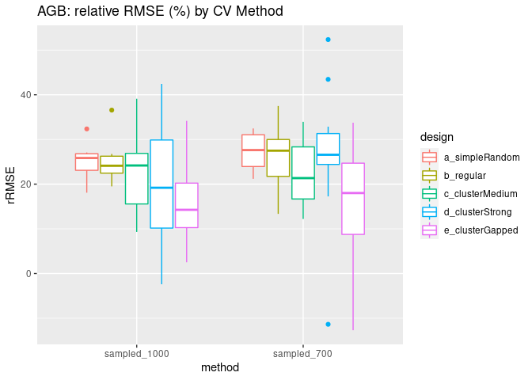
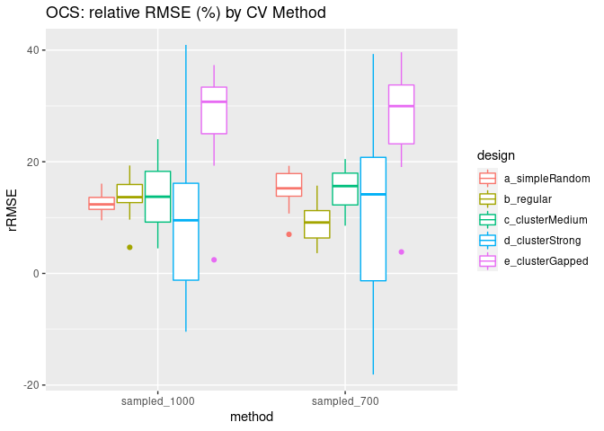

The idea here was to sample from the original 5000 points per sample
realization to speed up nndm processing.

## Sampling Designs

As a reminder: Plotting a randomly chosen sampling design example.



## Gather Result Data

Gather data from their output folders into a dataframe.

``` r
infolder <- "./CVresults"
outfolder <- "./material"

colnms <- c("method", "variate", "design", "number", "RMSE")
outtab <- data.frame(matrix(NA, 0, 10))
names(outtab) <- colnms

for(m in c("sampled_700", 
          "sampled_1000")){
  # get exhaustive
  p <- file.path(infolder, "exhaustive", m)
  f_ins <- list.files(p, glob2rx("???_*.Rdata"))
  for(f_in in f_ins){
    lchar <- nchar(f_in)
    variate <- substr(f_in, 1, 3)
    design <- substr(f_in, 5, lchar-9)
    number <- as.numeric(substr(f_in, lchar-8, lchar-6))
    load(file.path(p, f_in))
    if(length(RMSE) > 1) {
      RMSE <- mean(RMSE)
    }
    if(m == "sampled_700") {
      m = "exhaustive_700"
    }
    if(m == "sampled_1000") {
      m = "exhaustive_1000"
    }
    
    newrow <- data.frame(method = m, variate = variate, design = design,
                         number = number, RMSE = RMSE)
    outtab <- rbind(outtab, newrow)
  }
}

# get sampled
for(m in c("nndm_sampled700_samps_1000_mint_0", 
          "nndm_sampled1000_samps_1000_mint_0")){
  # get exhaustive
  p <- file.path(infolder, m)
  f_ins <- list.files(p, glob2rx("???_*.Rdata"))
  for(f_in in f_ins){
    lchar <- nchar(f_in)
    variate <- substr(f_in, 1, 3)
    design <- substr(f_in, 5, lchar-9)
    number <- as.numeric(substr(f_in, lchar-8, lchar-6))
    load(file.path(p, f_in))
    if(length(RMSE) > 1) {
      RMSE <- mean(RMSE)
    }
    if(m == "nndm_sampled700_samps_1000_mint_0") {
      m = "sampled_700"
    }
    if(m == "nndm_sampled1000_samps_1000_mint_0") {
      m = "sampled_1000"
    }
    
    newrow <- data.frame(method = m, variate = variate, design = design,
                         number = number, RMSE = RMSE)
    outtab <- rbind(outtab, newrow)
  }
}

write.xlsx(outtab, file.path(outfolder, "outtab100.xlsx"), overwrite = T)
head(outtab)
```

    ##           method variate        design number     RMSE
    ## 1 exhaustive_700     AGB clusterGapped      1 30.34413
    ## 2 exhaustive_700     AGB clusterGapped      2 30.80196
    ## 3 exhaustive_700     AGB clusterGapped      3 32.06104
    ## 4 exhaustive_700     AGB clusterGapped      4 32.39328
    ## 5 exhaustive_700     AGB clusterGapped      5 31.24752
    ## 6 exhaustive_700     AGB clusterGapped      6 30.30192

``` r
ggplot(data=outtab[outtab$variate == "AGB",]) +
  geom_boxplot(aes(x=method, y=RMSE, color=design)) +
  ggtitle("AGB: RMSE by CV Method")
```

    ## Warning: Removed 1 rows containing non-finite values (stat_boxplot).



``` r
ggplot(data=outtab[outtab$variate == "OCS",]) +
  geom_boxplot(aes(x=method, y=RMSE, color=design)) +
  ggtitle("OCS: RMSE by CV Method")
```



``` r
mytab <- outtab[outtab$variate == "AGB",]
# mytab <- mytab[mytab$number < 6,]
mytab$rRMSE <- NA

for (design in unique(mytab$design)) {
  for (number in 1:10) {
    measurement <- which(mytab$design == design & mytab$number == number & mytab$method == "sampled_700")
    validation <- which(mytab$design == design & mytab$number == number & mytab$method == "exhaustive_700")
    mytab$rRMSE[measurement] <- 100 * (mytab$RMSE[measurement] - mytab$RMSE[validation])/
        mytab$RMSE[validation]
    
    measurement <- which(mytab$design == design & mytab$number == number & mytab$method == "sampled_1000")
    validation <- which(mytab$design == design & mytab$number == number & mytab$method == "exhaustive_1000")
    mytab$rRMSE[measurement] <- 100 * (mytab$RMSE[measurement] - mytab$RMSE[validation])/
        mytab$RMSE[validation]
  }
}

# boxplot(rRMSE~method, data=mytab)

mytab$design[mytab$design == "clusterGapped"] <- "e_clusterGapped"
mytab$design[mytab$design == "simpleRandom"] <- "a_simpleRandom"
mytab$design[mytab$design == "regular"] <- "b_regular"
mytab$design[mytab$design == "clusterMedium"] <- "c_clusterMedium"
mytab$design[mytab$design == "clusterStrong"] <- "d_clusterStrong"

# mytab$design[mytab$method == "sampled_700"] <- "a_sampled_700"
# mytab$design[mytab$design == "sampled_1000"] <- "b_sampled_1000"

levels(as.factor(mytab$design))
```

    ## [1] "a_simpleRandom"  "b_regular"       "c_clusterMedium" "d_clusterStrong"
    ## [5] "e_clusterGapped"

``` r
ggplot(data=mytab[(mytab$method != "exhaustive_1000" & mytab$method != "exhaustive_700"),]) +
  geom_boxplot(aes(x=method, y=rRMSE, color=design)) +
  ggtitle("AGB: relative RMSE (%) by CV Method")
```

    ## Warning: Removed 1 rows containing non-finite values (stat_boxplot).



``` r
mytab <- outtab[outtab$variate == "OCS",]
# mytab <- mytab[mytab$number < 6,]
mytab$rRMSE <- NA

for (design in unique(mytab$design)) {
  for (number in 1:10) {
    measurement <- which(mytab$design == design & mytab$number == number & mytab$method == "sampled_700")
    validation <- which(mytab$design == design & mytab$number == number & mytab$method == "exhaustive_700")
    mytab$rRMSE[measurement] <- 100 * (mytab$RMSE[measurement] - mytab$RMSE[validation])/
        mytab$RMSE[validation]
    
    measurement <- which(mytab$design == design & mytab$number == number & mytab$method == "sampled_1000")
    validation <- which(mytab$design == design & mytab$number == number & mytab$method == "exhaustive_1000")
    mytab$rRMSE[measurement] <- 100 * (mytab$RMSE[measurement] - mytab$RMSE[validation])/
        mytab$RMSE[validation]
  }
}

# boxplot(rRMSE~method, data=mytab)

mytab$design[mytab$design == "clusterGapped"] <- "e_clusterGapped"
mytab$design[mytab$design == "simpleRandom"] <- "a_simpleRandom"
mytab$design[mytab$design == "regular"] <- "b_regular"
mytab$design[mytab$design == "clusterMedium"] <- "c_clusterMedium"
mytab$design[mytab$design == "clusterStrong"] <- "d_clusterStrong"

# mytab$design[mytab$method == "sampled_700"] <- "a_sampled_700"
# mytab$design[mytab$design == "sampled_1000"] <- "b_sampled_1000"

levels(as.factor(mytab$design))
```

    ## [1] "a_simpleRandom"  "b_regular"       "c_clusterMedium" "d_clusterStrong"
    ## [5] "e_clusterGapped"

``` r
ggplot(data=mytab[(mytab$method != "exhaustive_1000" & mytab$method != "exhaustive_700"),]) +
  geom_boxplot(aes(x=method, y=rRMSE, color=design)) +
  ggtitle("OCS: relative RMSE (%) by CV Method")
```



-   nndm ohne phi aus CAST paket
