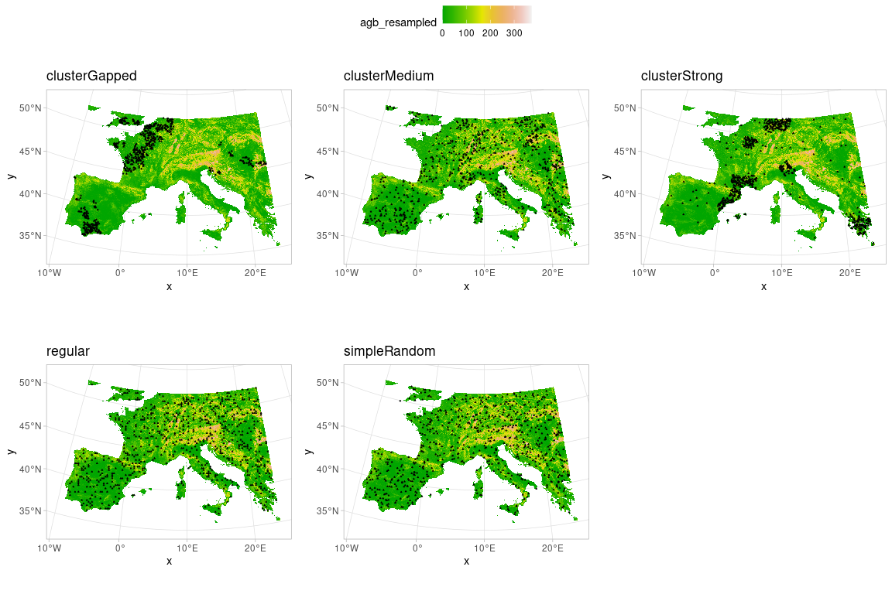
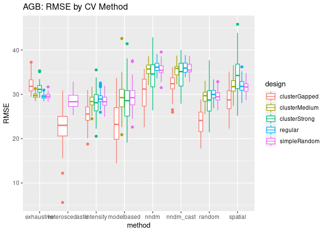
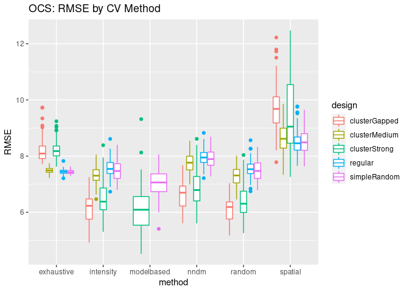
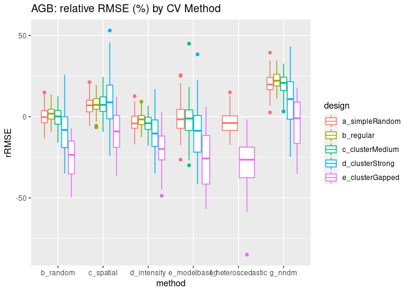
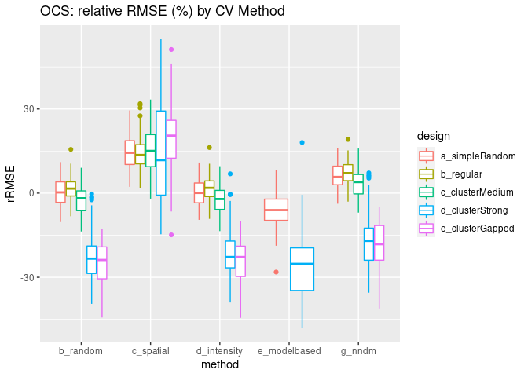

# Adding NNDM to “Dealing with Clustered Samples …”

1.  Reproducing most of the existing methodology with 100 sampling
    realizations (100 in original study) of 700 points (5000) and 3 CV
    iterations (100).

2.  Adding the NNDM CV method.

## Sampling Designs

As a reminder: Plotting a randomly chosen sampling design example.



## Gather Result Data

Gather data from their output folders into a dataframe.

``` r
# ************************************************************************
# ******************************* Figure 9 *******************************
# ************************************************************************
library(openxlsx)

infolder  <- "./CVresults"
outfolder <- "./material"

mets <- c("exhaustive", "random", "spatial", "intensity",
          "modelbased", "heteroscedastic", "nndm", "nndm_cast")

colnms <- c("method", "variate", "design", "number", "RMSE", "MEC")
outtab <- data.frame(matrix(NA, 0, 10))
names(outtab) <- colnms

for(m in mets){
  p <- file.path(infolder, m)
  f_ins <- list.files(p, glob2rx("???_*.Rdata"))
  for(f_in in f_ins){
    lchar <- nchar(f_in)
    variate <- substr(f_in, 1, 3)
    design <- substr(f_in, 5, lchar-9)
    number <- as.numeric(substr(f_in, lchar-8, lchar-6))
    load(file.path(p, f_in))
    if(length(RMSE) > 1) {
      RMSE <- mean(RMSE)
    }
    if(m == "modelbased" | m == "heteroscedastic"){
      MEC    <- mean(MECs)
      RMSE   <- mean(RMSEs)
    } else{
      if(length(MEC) > 1){
        MEC  <- mean(MEC)
        RMSE <- mean(RMSE)
      }
    }
    
    newrow <- data.frame(method = m, variate = variate, design = design,
                         number = number, RMSE = RMSE, MEC = MEC)
    outtab <- rbind(outtab, newrow)
  }
}

write.xlsx(outtab, file.path(outfolder, "outtab100.xlsx"), overwrite = T)
```

``` r
ggplot(data=outtab[outtab$variate == "AGB",]) +
  geom_boxplot(aes(x=method, y=RMSE, color=design)) +
  ggtitle("AGB: RMSE by CV Method")
```



``` r
ggplot(data=outtab[outtab$variate == "OCS",]) +
  geom_boxplot(aes(x=method, y=RMSE, color=design)) +
  ggtitle("OCS: RMSE by CV Method")
```



``` r
mytab <- outtab[outtab$variate == "AGB",]
# mytab <- mytab[mytab$number < 6,]
mytab$rRMSE <- NA
mytab$rMEC  <- NA

for (design in unique(mytab$design)) {
  for (number in 1:100) {
    measurement <- which(mytab$design == design & mytab$number == number)
    validation <- which(mytab$design == design & mytab$number == number & mytab$method == "exhaustive")
    mytab$rRMSE[measurement] <- 100 * (mytab$RMSE[measurement] - mytab$RMSE[validation])/
        mytab$RMSE[validation]
    mytab$rMEC[measurement] <- 100 * (mytab$MEC[measurement] - mytab$MEC[validation])/
        mytab$MEC[validation]
  }
}

# boxplot(rRMSE~method, data=mytab)

mytab$design[mytab$design == "clusterGapped"] <- "e_clusterGapped"
mytab$design[mytab$design == "simpleRandom"] <- "a_simpleRandom"
mytab$design[mytab$design == "regular"] <- "b_regular"
mytab$design[mytab$design == "clusterMedium"] <- "c_clusterMedium"
mytab$design[mytab$design == "clusterStrong"] <- "d_clusterStrong"

mytab$method[mytab$method == "exhaustive"] <- "a_exhaustive"
mytab$method[mytab$method == "random"] <- "b_random"
mytab$method[mytab$method == "spatial"] <- "c_spatial"
mytab$method[mytab$method == "intensity"] <- "d_intensity"
mytab$method[mytab$method == "modelbased"] <- "e_modelbased"
mytab$method[mytab$method == "heteroscedastic"] <- "f_heteroscedastic"
mytab$method[mytab$method == "nndm"] <- "g_nndm"


levels(as.factor(mytab$design))
```

    ## [1] "a_simpleRandom"  "b_regular"       "c_clusterMedium" "d_clusterStrong"
    ## [5] "e_clusterGapped"

``` r
ggplot(data=mytab[mytab$method != "a_exhaustive",]) +
  geom_boxplot(aes(x=method, y=rRMSE, color=design)) +
  ggtitle("AGB: relative RMSE (%) by CV Method")
```



``` r
mytab <- outtab[outtab$variate == "OCS",]
# mytab <- mytab[mytab$number < 6,]
mytab$rRMSE <- NA
mytab$rMEC  <- NA

for (design in unique(mytab$design)) {
  for (number in c(1:85, 94:100)) {
    measurement <- which(mytab$design == design & mytab$number == number)
    validation <- which(mytab$design == design & mytab$number == number & mytab$method == "exhaustive")
    mytab$rRMSE[measurement] <- 100 * (mytab$RMSE[measurement] - mytab$RMSE[validation])/
        mytab$RMSE[validation]
    mytab$rMEC[measurement] <- 100 * (mytab$MEC[measurement] - mytab$MEC[validation])/
        mytab$MEC[validation]
  }
}

# boxplot(rRMSE~method, data=mytab)

mytab$design[mytab$design == "clusterGapped"] <- "e_clusterGapped"
mytab$design[mytab$design == "simpleRandom"] <- "a_simpleRandom"
mytab$design[mytab$design == "regular"] <- "b_regular"
mytab$design[mytab$design == "clusterMedium"] <- "c_clusterMedium"
mytab$design[mytab$design == "clusterStrong"] <- "d_clusterStrong"

mytab$method[mytab$method == "exhaustive"] <- "a_exhaustive"
mytab$method[mytab$method == "random"] <- "b_random"
mytab$method[mytab$method == "spatial"] <- "c_spatial"
mytab$method[mytab$method == "intensity"] <- "d_intensity"
mytab$method[mytab$method == "modelbased"] <- "e_modelbased"
mytab$method[mytab$method == "heteroscedastic"] <- "f_heteroscedastic"
mytab$method[mytab$method == "nndm"] <- "g_nndm"


levels(as.factor(mytab$design))
```

    ## [1] "a_simpleRandom"  "b_regular"       "c_clusterMedium" "d_clusterStrong"
    ## [5] "e_clusterGapped"

``` r
ggplot(data=mytab[mytab$method != "a_exhaustive",]) +
  geom_boxplot(aes(x=method, y=rRMSE, color=design)) +
  ggtitle("OCS: relative RMSE (%) by CV Method")
```

    ## Warning: Removed 168 rows containing non-finite values (stat_boxplot).



-   nndm ohne phi aus CAST paket
